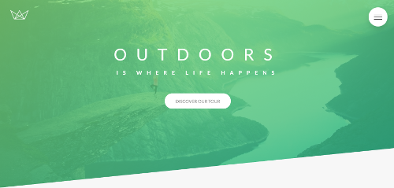
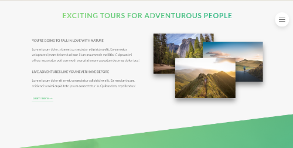
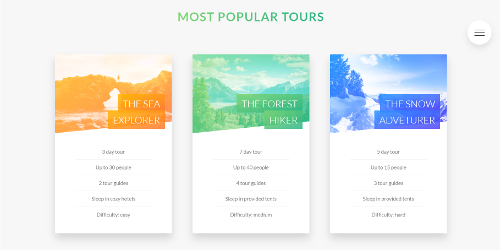

# Advanced CSS and SASS

I created this **modern responsive website** as a part of an online course created and designed by **Jonas Schmedtmann**.

I used the **7-1 rule**, component-based design and the **BEM methodology** to write **reusable**, **maintainable** and **scalable** code. 
The compilation, concatenation and compressing of the files are done using **NPM**.

## Advanced features used:

- **CSS**:
  - clip-path
  - background-clip,
  - mask-image
  - background-blend-mode
  - shape-outside
  - filter
  - backdrop-filter
  - object-fit
  - transform
  - column-count
  - hyphens
  - perspective
  - calc() and custom CSS properties
  - CSS animations with @keyframes, animation and transition
  - CSS selectors, pseudo-classes and pseudo-elements

- **Sass**: 
  - variables
  - nesting
  -  partials
  - imports
  - mixins
  - functions
  - extends

## Screenshots:

  

      
  

  

      
  

    

      
  

    

      
  
